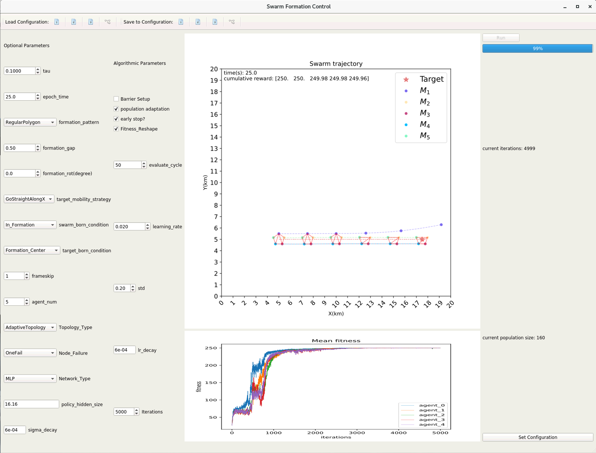
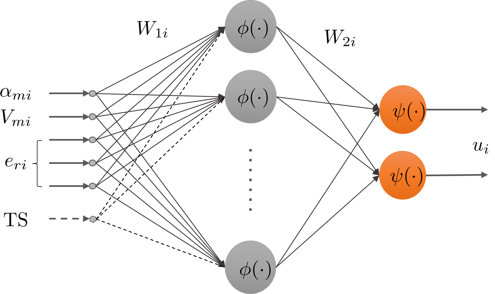

# About this project

This project comes along with the research paper "Formation control with connectivity assurance for missile swarm: A natural co-evolutionary approach". An evolutionary-strategy-based algorithm was implemented to perform missile formation control, owing to flexibility of the adaptive neural network controller the control performance is desirable in many scenarios. 

<p float="left">
  
   
</p>

This project is available as a stand-alone lab kit with configurable simulation scenario.
The `environmnent` directory is used to keep the simulation environment, which is built upon [pybullet](https://github.com/bulletphysics/bullet3), the physic simulation engine. Implementation algorithm is stored in the `Evo_Stra` directory, and can be excuted mainly from the outermost folder. Then the trained models and analytical details are saved in cooresponding folders, which can be easily checked during the training process. To facilate testing, GUI entry is available in the `GUI` folder, which gives a visualized presentation of the evolution process.

### Prerequistes

Install the required python modules using the following command

```
pip install -r ./requirements.txt
```

# Running the experimemt

To start training, you can either use command line or utilize the GUI process.

### command line

```
python Train.py
```

### GUI

```
python ./GUI/main_window.py
```

Tuning the configuration in the panel which contains major parameters, or editing the complete paremeters in the configuration file. Push the save button to apply it. By default, configuration file is saved in the `Common` directory in json format. If you like, you can save the configurations for each cases for the following experiments.

# Evaluating results

Saving the results in the `CasesResults` folder for evaluation. In this project, all pretrained models for the paper have been saved and thus can be evaluated using the following command:

```
python EvaluateModel.py --path=<pathToSavedResults>
```

 for example, let `path` be `"./CasesResults/basic_formation_control/linear"` . Results are saved in the same level directory where the models are saved.

# Acknowledgments

For security reasons the complete code will be released after the paper is accepted and published, however you can still run the evaluation program to view the result.
